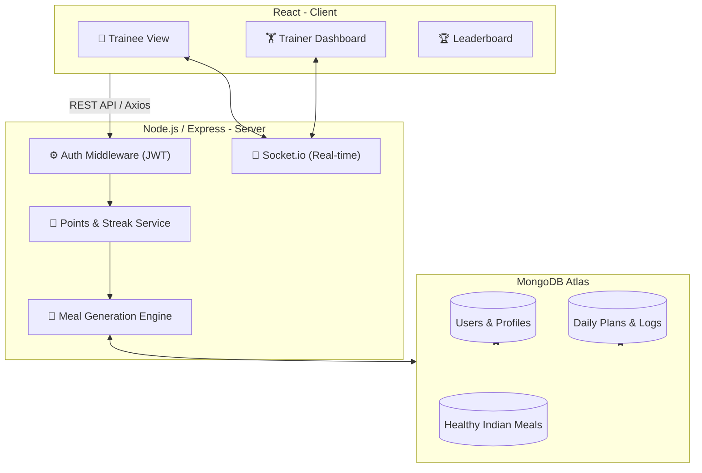

# ⚡ GrindTogether — Community Fitness Progress Tracker

> **Turn the gym into a competitive, accountable social ecosystem.** GrindTogether is a production-grade social fitness platform designed to bridge the gap between trainees and trainers through real-time data sync, gamified motivation, and localized nutritional focus.

---

## 🏗️ System Architecture



---

## ✨ Features

### 🥗 Healthy South Indian Diet Engine [NEW]
- **Traditional Superfoods**: Automated meal plans featuring **Millet Upma, Moringa Leaf Idli, Ragi Mudde, and Moong Dal Pesarattu**.
- **Goal Specificity**: Low-carb/High-fiber plans for **Weight Loss** and High-protein lean plans for **Muscle Gain**.
- **Seedable Database**: 22+ curated traditional South Indian diet items with full macro breakdown.

### 🔄 Live Activity Sync [NEW]
- **Automatic Logging**: Daily Plan progress (Meals, Water, Workout) syncs **instantly** to the Today's Summary section in the Log page.
- **Socket-Based Push**: Real-time updates ensure trainers see member progress immediately without page refreshes.

### 🎮 Trainee Experience
- **Interactive Checklist**: Daily workout, hydration, and nutrition tracking.
- **Visual Analytics**: Dynamic charts showing weight and activity progress.
- **Points & Streaks**: Earn points for consistency; maintain streaks to climb the leaderboard.
- **Profile QR**: Easy trainer verification and member identification.

### 👤 Trainer Management
- **Centralized Dashboard**: Monitor every member's daily status across multiple gym branches.
- **Live Feed**: See when members finish workouts or hit their protein goals in real-time.

---

## 🛠️ Tech Stack

| Layer | Technology | Description |
|-------|-----------|-------------|
| **Frontend** | React 18 + Vite | Fast, modular component-based UI. |
| **State** | Zustand | Lightweight state management for Auth & UI. |
| **Styling** | Vanilla CSS | **Brutalist Dark Neon Gym** aesthetic with glassmorphism. |
| **Real-time** | Socket.io | Bi-directional communication for live updates. |
| **Backend** | Express.js | Robust REST API architecture. |
| **Database** | MongoDB | Mongoose ODM for flexible document storage. |
| **DevOps** | JWT + Cookie | Secure, HTTP-only authentication flow. |

---

## 🚀 Getting Started

### 1. Prerequisites
- **Node.js 20+**
- **MongoDB** (Local or Atlas)

### 2. Installation

Clone the repository and install all dependencies:

```bash
# In the root directory
npm run install:all
```

### 3. Configuration

Configure your environment variables in `server/.env`:

```env
PORT=3000
MONGODB_URI=your_mongodb_connection_string
JWT_SECRET=your_secret_key
# VITE_API_URL should point to http://localhost:3000 for local dev
```

### 4. Database Seeding (Crucial)

To populate the **Healthy South Indian** menu and workout templates, run:

```bash
cd server
node src/scripts/seedMeals.js
```

### 5. Running the App

```bash
# From the root — starts both client and server
npm run dev
```

---

## 📖 How to Use

### For Trainees:
1. **Register** and complete your profile with starting weight and fitness goal.
2. Visit the **Daily Plan** every morning to see your generated tasks and meal recommendations.
3. Check off tasks as you finish them. Points are added instantly!
4. Use the **Log Activity** page to add your weight and personal notes—your plans will sync automatically.

### For Trainers:
1. Create a **Trainer Account**.
2. Visit the **Member Dashboard** to monitor members in your specific branch (e.g., "Central").
3. View the **Leaderboard** to track top-performing trainees globally.

---

## 📄 License & Report
For detailed deployment instructions, see the [Deployment Report](./C:/Users/MONESH%20M/.gemini/antigravity/brain/071485b7-63fe-42ce-bc59-91568000161b/deployment_report.md).

Developed with 🔥 by **Antigravity AI** for **GrindTogether**.
